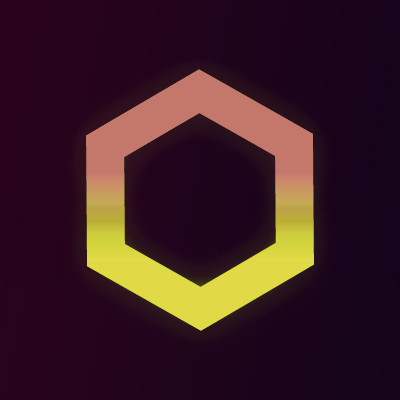
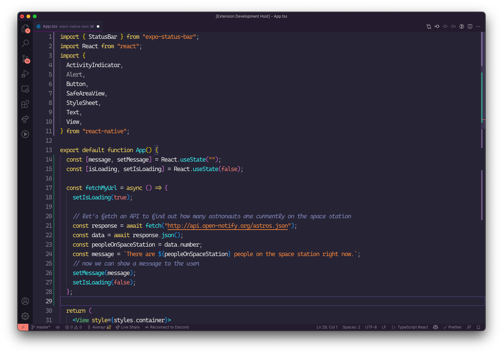

<p align="center" style="font-size: 32px;"></p>
<p align="center" style="font-size: 32px;">Synthwave Refined</p>
<p align="center"><a href="https://marketplace.visualstudio.com/items?itemName=RobbOwen.synthwave-vscode">SynthWave '84</a> refined to perfection</p>
<center></center>

# Important note

This theme does not support the glow effects of the original <a href="https://marketplace.visualstudio.com/items?itemName=RobbOwen.synthwave-vscode">SynthWave '84</a>.

# Motivation

I love the original SynthWave theme, but I wanted to make the color less harsh on the eyes.
That's why some bright red colors were swapped with white.

# Credits

All credit for the color scheme goes to <a href="https://github.com/robb0wen">robb0wen</a> for his awesome <a href="https://marketplace.visualstudio.com/items?itemName=RobbOwen.synthwave-vscode">SynthWave '84</a> theme.

Icon is a modified version of the original <a href="https://github.com/robb0wen/synthwave-vscode/blob/master/icon.png">SynthWave '84 icon</a>

# Contributing

All contributions are warmly welcome. Let's make this theme better together! 🤗

# Recommended font settings

```json
{
  "editor.letterSpacing": -1.7, // because original Cascadia Code is too wide
  "editor.fontLigatures": "'calt', 'ss01'", // turns on ligatures and cursive
  "editor.fontFamily": "'Cascadia Code PL Semilight'", // only works with statically generated .ttf files (don't use variable fonts)
  "workbench.fontAliasing": "antialiased" // VERY IMPORTANT ON MAC OS
}
```
